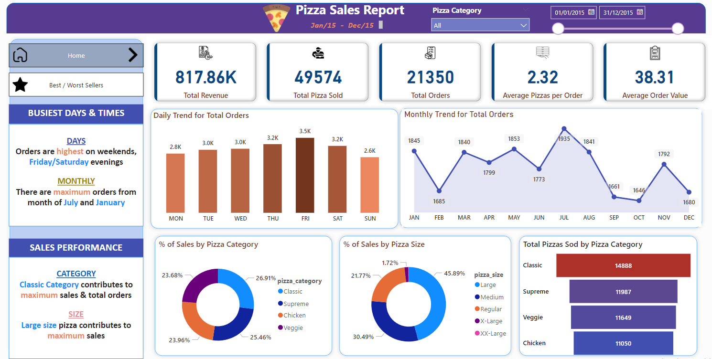
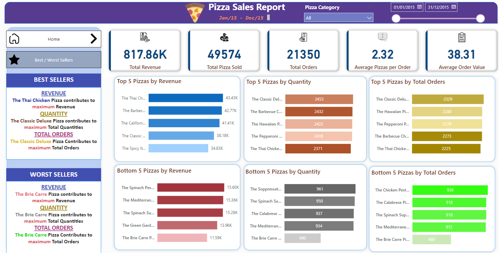

# Pizza Sales Analysis

## Project Overview
This project analyzes pizza sales data using Power BI to generate insights on revenue, order trends, and pizza category performance. The data covers the period from January 2015 to December 2015, focusing on metrics like total revenue, number of pizzas sold, and average order values.

## Problem Statement

### Business Challenge:
A pizza chain is experiencing inconsistent sales performance across its various locations and needs better insights into its sales patterns. The management team is struggling to understand which factors contribute to the variation in pizza sales, such as:

- Which days and times generate the most sales?
- Which pizza categories and sizes perform best?
- Are there specific months where sales peak or decline?
- What are the top and bottom-selling pizzas, and how can the product mix be optimized?

Currently, decisions are being made based on intuition rather than data, resulting in lost opportunities for revenue optimization and efficient resource allocation. 

### Business Goals:
The company needs a data-driven approach to answer these questions and identify trends to:

- Optimize their inventory and staffing based on high and low demand periods.
- Enhance their product offerings by focusing on high-selling pizzas.
- Create targeted marketing strategies around peak sales periods and best-selling products.
- Improve overall sales and profitability by focusing on underperforming areas.

### Solution:
This project addresses the problem by analyzing the pizza sales data over a year, providing detailed insights into sales trends, best-selling pizzas, and customer preferences. The Power BI visualizations offer actionable intelligence, helping the pizza chain improve its operations, product offerings, and marketing strategies to enhance profitability.

## Dataset
The dataset includes pizza sales information from January 1st, 2015 to December 31st, 2015. The main features of the dataset include:

- **Total Revenue**: $817.86K
- **Total Pizza Sold**: 49,574 pizzas
- **Total Orders**: 21,350 orders
- **Average Pizzas per Order**: 2.32
- **Average Order Value**: $38.31

## Key Insights
- **Busiest Days**: Orders are highest on weekends, particularly on Friday and Saturday evenings.
- **Best Months**: July and January have the most orders.
- **Best-Selling Pizza**: Thai Chicken Pizza generates the highest revenue, while Classic Deluxe Pizza has the highest total quantity sold.
- **Worst-Selling Pizza**: Brie Carre Pizza ranks lowest in terms of revenue, total quantity sold, and total orders.

### Pizza Category Sales
- **Classic Category** contributes the most to total sales.
- **Large pizzas** generate the highest revenue across all size categories.

### Sales Performance by Pizza Size
- **Large** size pizzas are the best-sellers by both quantity and revenue.

## Visualizations
The analysis includes the following Power BI visuals:

1. **Daily Trend for Total Orders**: Shows the fluctuation in daily orders over the week.
2. **Monthly Trend for Total Orders**: Displays the variation in orders across months.
3. **Sales by Pizza Category**: Breakdown of sales percentage by pizza category.
4. **Sales by Pizza Size**: Breakdown of sales percentage by pizza size.
5. **Top 5 and Bottom 5 Pizza Sellers**: A list of the best and worst performing pizzas in terms of revenue, quantity, and total orders.
<table>
  <tr>
    <td></td>
    <td></td>
  </tr>
</table>

## Tools Used
- **Power BI**: Used for data visualization and generating insights.
- **CSV Dataset**: Raw sales data was provided in a CSV format.

## Future Improvements
- Include more advanced sales forecasting models.
- Add customer demographic data for better segmentation and targeted marketing.
